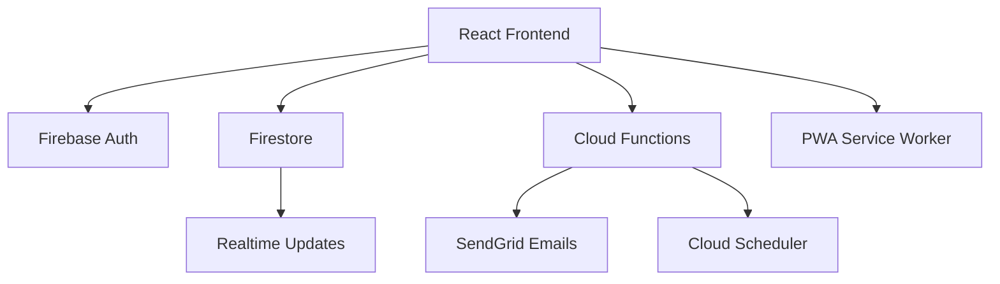

# McDuck Bank 🏦

<div align="center">

[](https://reactjs.org/)
[](https://firebase.google.com/)
[](https://mui.com/)
[](https://cloud.google.com/)
[](https://web.dev/progressive-web-apps/)
[](LICENSE)

</div>

**A self‑hosted family banking ledger built entirely with [Claude Code](https://claude.ai/code).**

McDuck Bank lets parents manage allowances and savings for the whole family. It is not a real bank account service—think of it as an open source digital piggy bank. You'll need some JavaScript and Firebase know‑how to deploy your own instance.

---

## ✨ Features

- 🔐 **Secure Google Sign‑In** with Firebase Authentication
- 👪 **Parent and Kid Roles** with granular permissions
- 💰 **Real‑Time Transaction Ledger** and account balances
- 📝 **Withdrawal Requests** with parental approval flow
- 💵 **Automated Monthly Interest** payments
- 📧 **Statement Emails** generated and sent each month
- 📊 **Admin Dashboard** with logs and account tools
- 🔄 **Cloud Functions & Scheduler** for server‑side tasks
- 📱 **Progressive Web App** installable on phones
- 🛡️ **Comprehensive Audit Logging** for all operations

## 🏗️ Architecture



## 🚀 Quick Start

### Prerequisites

- Node.js 18+
- Firebase CLI
- SendGrid account for emails
- A Firebase project with Firestore and Authentication enabled

### Installation

```bash
# Clone and install
git clone https://github.com/yourusername/mcduck-bank.git
cd mcduck-bank
npm install

# Copy environment variables
cp .env.example .env.local
```
Edit `.env.local` with your Firebase config.

```bash
# Start the development server
npm start
```
Visit [http://localhost:3000](http://localhost:3000) to view your app.

### Deploying

```bash
# Build and deploy the web app and functions
npm run build
firebase deploy
```

Cloud Scheduler jobs for interest payments and statement emails are deployed automatically with the functions.

## 🛠️ Tech Stack

- **React** with Material‑UI
- **Firebase** (Auth, Firestore, Cloud Functions, Hosting)
- **SendGrid** for transactional emails
- **Google Cloud Scheduler** for automated jobs

## 🤝 Contributing

Contributions are welcome! Please open issues and pull requests as you would with any major open source project.

## 📜 License

McDuck Bank is released under the MIT License.

---

Made with ❤️ and a lot of Claude Code.
