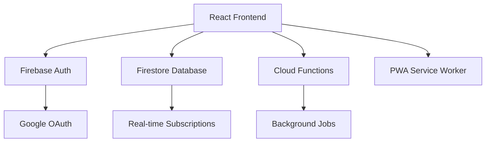

# McDuck Bank 🏦

<div align="center">

[](https://reactjs.org/)
[](https://firebase.google.com/)
[](https://mui.com/)
[](https://cloud.google.com/)
[](https://web.dev/progressive-web-apps/)
[](LICENSE)

**A modern, minimalist banking application built for the cloud-native era**

[🚀 Live Demo](https://mcduck-bank-2025.firebaseapp.com) • [📖 Documentation](./docs) • [🐛 Report Bug](../../issues) • [💡 Request Feature](../../issues)

</div>

---

## ✨ Features

- 🔐 **Secure Google Authentication** - OAuth 2.0 integration with Firebase Auth
- 👥 **Role-Based Access Control** - Admin and customer user roles with granular permissions
- 💰 **Transaction Management** - Complete transaction lifecycle with audit logging
- 📝 **Withdrawal Request System** - Admin approval workflow for withdrawal requests
- 📱 **Progressive Web App** - Mobile-first design with offline capabilities
- 🎨 **Modern UI/UX** - Clean Material Design 3 interface with dark mode support
- 🔄 **Real-Time Updates** - Live transaction updates using Firestore subscriptions
- 📊 **Admin Dashboard** - Comprehensive admin tools for user and transaction management
- 🛡️ **Enterprise Security** - Input sanitization, XSS protection, and audit trails
- ☁️ **Cloud-Native** - Designed for scalability on Google Cloud Platform

## 🏗️ Architecture



## 🚀 Quick Start

### Prerequisites

- Node.js 18.x or higher
- npm or yarn
- Firebase project with Firestore and Authentication enabled
- Google Cloud Platform account (for deployment)

### Installation

1. **Clone the repository**
   ```bash
   git clone https://github.com/yourusername/mcduck-bank-2025.git
   cd mcduck-bank-2025/mcduck-bank
   ```

2. **Install dependencies**
   ```bash
   npm install
   ```

3. **Configure environment variables**
   ```bash
   cp .env.example .env.local
   ```
   
   Update `.env.local` with your Firebase configuration:
   ```env
   REACT_APP_FIREBASE_API_KEY=your-api-key
   REACT_APP_FIREBASE_AUTH_DOMAIN=your-project.firebaseapp.com
   REACT_APP_FIREBASE_PROJECT_ID=your-project-id
   REACT_APP_FIREBASE_STORAGE_BUCKET=your-project.appspot.com
   REACT_APP_FIREBASE_MESSAGING_SENDER_ID=123456789
   REACT_APP_FIREBASE_APP_ID=1:123456789:web:abcdef
   ```

4. **Deploy Firestore security rules and indexes**
   ```bash
   firebase deploy --only firestore
   ```

5. **Start the development server**
   ```bash
   npm start
   ```

   Open [http://localhost:3000](http://localhost:3000) to view the application.

## 📂 Project Structure

```
mcduck-bank/
├── public/                 # Static assets and PWA manifest
├── src/
│   ├── components/         # Reusable UI components
│   │   ├── AdminTransactionForm.js
│   │   ├── PaginatedTransactionTable.js
│   │   └── ...
│   ├── pages/             # Route-level components
│   │   ├── Dashboard.js
│   │   ├── AdminPanel.js
│   │   └── ...
│   ├── services/          # API and business logic services
│   │   ├── transactionService.js
│   │   ├── withdrawalTaskService.js
│   │   └── ...
│   ├── store/             # Redux Toolkit store and slices
│   ├── utils/             # Utility functions and helpers
│   ├── contexts/          # React Context providers
│   └── hooks/             # Custom React hooks
├── functions/             # Firebase Cloud Functions
├── firestore.rules        # Firestore security rules
├── firestore.indexes.json # Firestore composite indexes
└── cloudbuild.yaml        # Google Cloud Build configuration
```

## 🔧 Available Scripts

| Command | Description |
|---------|-------------|
| `npm start` | Start development server |
| `npm test` | Run test suite |
| `npm run build` | Build for production |
| `npm run deploy` | Deploy to Firebase Hosting |
| `npm run functions:deploy` | Deploy Cloud Functions |
| `npm run firestore:deploy` | Deploy Firestore rules and indexes |

## 🛠️ Tech Stack

### Frontend
- **React 18** - Modern UI library with hooks and concurrent features
- **Redux Toolkit** - State management with RTK Query
- **Material-UI 5** - Component library with Material Design 3
- **React Router 6** - Client-side routing

### Backend & Infrastructure
- **Firebase Authentication** - User authentication and authorization
- **Cloud Firestore** - NoSQL document database with real-time sync
- **Firebase Cloud Functions** - Serverless backend logic
- **Google Cloud Run** - Container-based hosting
- **Firebase Hosting** - Static site hosting for frontend

### Development & DevOps
- **ESLint & Prettier** - Code formatting and linting
- **Jest & React Testing Library** - Unit and integration testing
- **Google Cloud Build** - CI/CD pipeline
- **Firebase CLI** - Deployment and management tools

## 🔒 Security Features

- **Firebase Security Rules** - Database-level access control
- **Input Sanitization** - XSS and injection attack prevention
- **Audit Logging** - Complete transaction audit trail
- **Rate Limiting** - Protection against abuse
- **Session Management** - Secure token handling
- **Role-Based Permissions** - Granular access control

## 🚀 Deployment

### Firebase Hosting (Recommended)

1. **Build the application**
   ```bash
   npm run build
   ```

2. **Deploy to Firebase**
   ```bash
   firebase deploy
   ```

### Google Cloud Run

1. **Build container image**
   ```bash
   gcloud builds submit --tag gcr.io/PROJECT-ID/mcduck-bank
   ```

2. **Deploy to Cloud Run**
   ```bash
   gcloud run deploy --image gcr.io/PROJECT-ID/mcduck-bank --platform managed
   ```

## 📊 Performance

- **Lighthouse Score**: 95+ across all metrics
- **Bundle Size**: ~350KB gzipped
- **First Contentful Paint**: <1.5s
- **Time to Interactive**: <3s
- **Core Web Vitals**: All green

## 🤝 Contributing

We welcome contributions! Please see our [Contributing Guide](CONTRIBUTING.md) for details.

1. **Fork the repository**
2. **Create a feature branch** (`git checkout -b feature/amazing-feature`)
3. **Commit your changes** (`git commit -m 'Add amazing feature'`)
4. **Push to the branch** (`git push origin feature/amazing-feature`)
5. **Open a Pull Request**

### Development Guidelines

- Follow the existing code style and patterns
- Write tests for new features
- Update documentation as needed
- Ensure all tests pass before submitting PR

## 📝 License

This project is licensed under the MIT License - see the [LICENSE](LICENSE) file for details.

## 🙏 Acknowledgments

- [Create React App](https://create-react-app.dev/) for the initial setup
- [Material-UI](https://mui.com/) for the component library
- [Firebase](https://firebase.google.com/) for the backend infrastructure
- [Google Cloud Platform](https://cloud.google.com/) for hosting and services

## 📈 Roadmap

- [ ] Mobile companion app (React Native)
- [ ] Advanced analytics dashboard
- [ ] Multi-currency support
- [ ] API rate limiting dashboard
- [ ] Automated compliance reporting
- [ ] Integration with banking APIs

---

<div align="center">

**[⭐ Star this repository](../../stargazers) if you find it helpful!**

Made with ❤️ by the McDuck Bank team

</div>